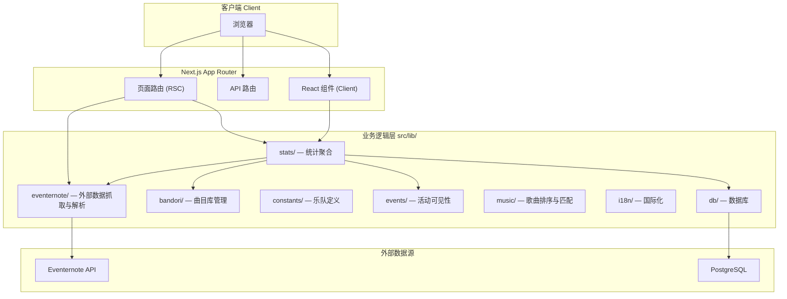
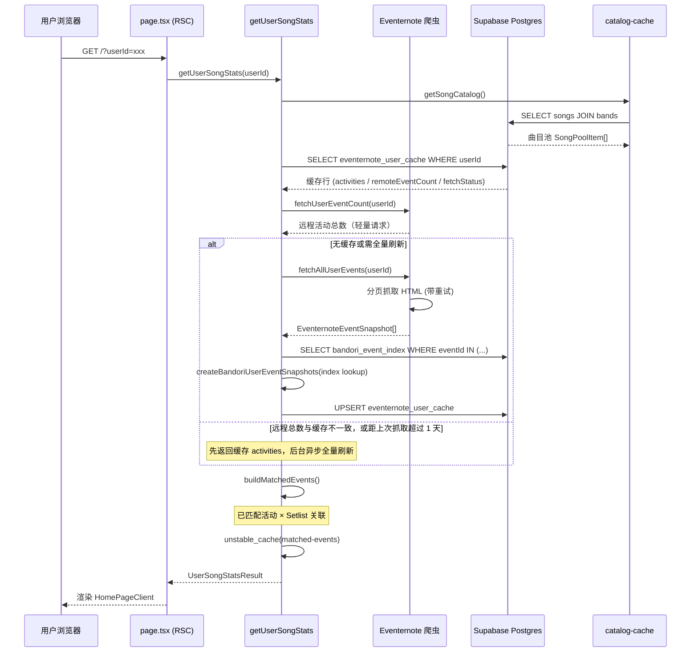
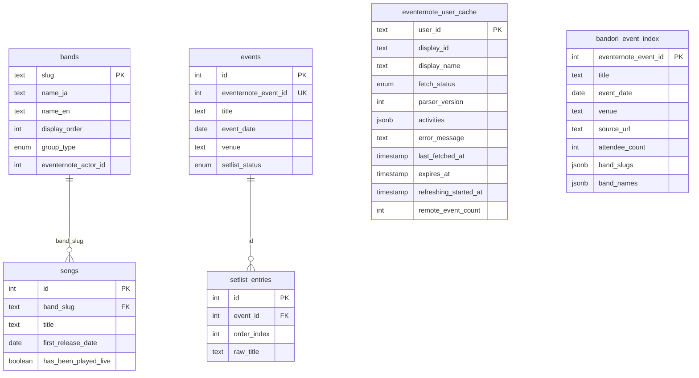
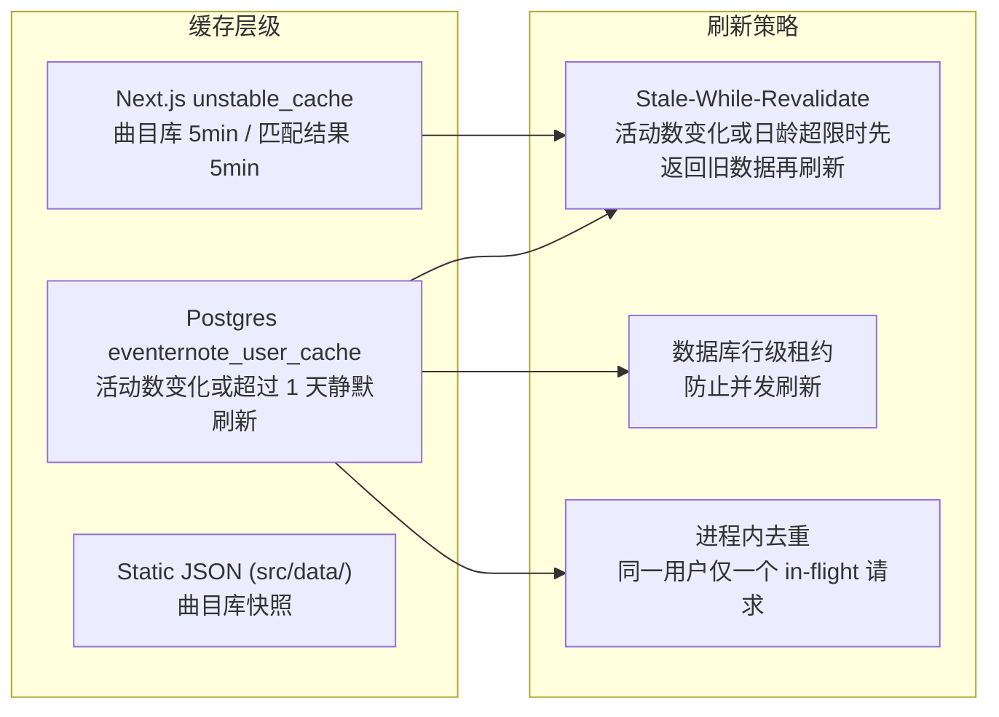
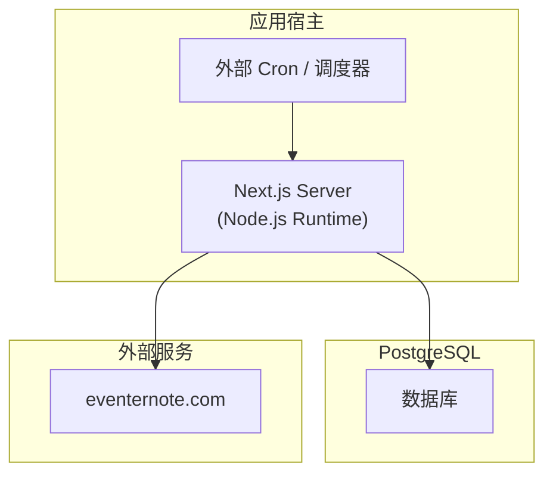

# BDR Events to Songs — 项目架构文档

## 1. 项目概述

**BanG Dream! Events to Songs** 是一个 Web 应用，用于查询用户在 [Eventernote](https://www.eventernote.com) 上参加过的 BanG Dream! 演出现场活动，并统计用户听过的歌曲覆盖情况。

核心功能：
- 输入 Eventernote 用户 ID，抓取该用户参加过的所有活动
- 匹配活动与 BanG Dream! 乐队，关联官方曲目库
- 统计每支乐队的歌曲听取覆盖率，展示已收录/缺失的 Setlist
- 支持深色/浅色主题切换

## 2. 技术栈

| 层级 | 技术 |
|------|------|
| 框架 | Next.js 16 (App Router, RSC) |
| 语言 | TypeScript 5 |
| UI | React 19 + Tailwind CSS 4 |
| 数据库 | Supabase Postgres (via Drizzle ORM) |
| 爬虫解析 | Cheerio |
| 数据校验 | Zod 4 |
| 测试 | Vitest (单元) + Playwright (E2E) |
| 部署 | 任意 Node.js 托管平台 |

## 3. 顶层目录结构

```
bdr-events-to-songs/
├── src/
│   ├── app/                    # Next.js App Router 路由
│   ├── components/             # React 组件
│   ├── data/                   # 静态 JSON 数据
│   └── lib/                    # 核心业务逻辑
├── scripts/                    # 离线数据管理脚本
├── tests/                      # 单元测试
├── drizzle.config.ts           # Drizzle ORM 配置
└── vitest.config.ts            # Vitest 配置
```

## 4. 架构分层图



## 5. 核心数据流

以下是用户查询的完整数据流：



## 6. 模块详解

### 6.1 `src/app/` — 路由层

```
app/
├── page.tsx                          # 首页 (RSC) — 查询入口 + 数据预取
├── layout.tsx                        # 根布局 — 字体、主题
├── globals.css                       # Tailwind 全局样式
├── api/
│   ├── song-events/route.ts          # 歌曲关联的活动列表 API
│   ├── user-refresh-status/route.ts  # 用户缓存刷新状态查询
│   ├── setlist-export/route.ts       # Setlist 导出 API
│   └── cron/event-ranking/route.ts   # 定时任务：刷新 bandori_event_index
└── admin/
    ├── list/                         # 管理后台 — 活动列表（查 index，年份/乐队复选）
    ├── recent/                       # 管理后台 — 近期活动（查 index）
    ├── rules/                        # 管理后台 — 活动可见性规则
    ├── songs-import/                 # 管理后台 — 歌曲导入
    ├── setlist-import/               # 管理后台 — Setlist 导入/编辑
    └── user-cache/                   # 管理后台 — 用户缓存只读浏览
```

**`page.tsx`** 是核心入口，采用 RSC 模式在服务端完成全部数据查询后，将结果序列化传递给客户端组件 `HomePageClient`。

### 6.2 `src/components/` — UI 组件层

```
components/
├── home-page-client.tsx              # 首页客户端壳 — 状态管理、表单、结果展示
├── results-client.tsx                # 结果展示主组件 — 组合布局
├── results/
│   ├── use-results-state.ts          # 结果页状态管理 Hook
│   ├── band-summary-card.tsx         # 乐队摘要卡片
│   ├── event-card.tsx                # 活动卡片
│   └── utils.ts                      # 共享工具函数
├── search-form.tsx                   # 搜索表单
├── theme-toggle.tsx                  # 主题切换
├── save-image-button.tsx             # 导出图片按钮
└── refresh-while-warming.tsx         # 缓存预热中的刷新组件
```

组件拆分策略：
- `results-client.tsx` 负责布局组合，从 `use-results-state` Hook 获取所有派生状态
- `BandSummaryCard` 和 `EventCard` 是纯展示组件，通过 props 接收数据
- 状态管理集中在 `use-results-state.ts`，包含筛选、展开、歌曲事件加载等逻辑

### 6.3 `src/lib/` — 业务逻辑层

#### 6.3.1 `stats/` — 统计聚合（核心业务）

```
stats/
├── get-user-song-stats.ts       # 主入口：用户歌曲统计编排
├── catalog-cache.ts             # 曲目库缓存 (unstable_cache)
├── build-matched-events.ts      # 活动 × 乐队 × Setlist 匹配
├── aggregate.ts                 # 前端聚合逻辑 (纯函数)
├── eventernote-cache-policy.ts  # 缓存策略：活动数比对 / 日龄静默刷新 / 租约
├── song-events-cache.ts         # 歌曲关联活动缓存
└── refresh-song-live-state.ts   # 刷新歌曲现场演出状态
```

**`get-user-song-stats.ts`** 是整个应用的核心编排函数，职责：
1. 并行获取曲目库和用户缓存
2. 判断缓存状态（缺失 / 远程活动数变化 / 距上次抓取超 1 天 / 解析器版本过旧 / 手动刷新）
3. 决定是否触发后台刷新（`after()` 调度）
4. 调用 `buildMatchedEvents` 完成活动-歌曲匹配
5. 返回 `UserSongStatsResult` 联合类型

缓存策略（**非固定时间 TTL**；`expires_at` 列保留但当前写入为 `null`）：

- 每次查询先轻量请求 Eventernote 用户活动页，解析**远程活动总数** `remoteEventCount`，与库中 `eventernote_user_cache.remote_event_count` 比对。
- **总数相同且距上次抓取不足 1 天**：视为缓存仍有效，直接返回已存 `activities`。
- **总数相同但距上次抓取超过 1 天**：立即返回旧 `activities`，并静默后台全量刷新。
- **总数不同**：立即返回旧 `activities`（`staleCacheUsed: true`），并后台触发全量分页抓取更新缓存（stale-while-revalidate）。
- **无缓存行**：返回 warming，执行全量抓取初始化。
- **无法取得远程总数**（站点异常等）：不触发刷新，尽量返回已有缓存。
- 管理页 `/admin/user-cache` 可只读浏览缓存行（用户名 / 昵称 / 抓取状态 / 时间 / 远程活动数）。
- **解析器版本**（`parserVersion`）升级时：同步全量刷新。
- **用户手动刷新**（`?refresh=1` 或 `awaitFreshAfter`）：按 inline/background 模式强制刷新。
- 使用数据库行级租约（`refreshingStartedAt`，5 分钟）与进程内去重，防止同一用户并发全量抓取。

#### 6.3.2 `eventernote/` — Eventernote 爬虫

```
eventernote/
├── client.ts                # HTTP 客户端：分页抓取、重试、超时
├── parser.ts                # 纯 HTML 解析（Cheerio）：可独立测试
├── bandori-user-events.ts   # 用户活动 eventId × 索引 → 乐队匹配
├── bandori-event-index.ts   # bandori_event_index 读写
├── actor-events.ts          # 演员活动查询
├── event-meta.ts            # 活动元数据
├── event-ranking-snapshot.ts # 演员页抓取 → upsert bandori_event_index
├── match-rules.ts           # 活动日期可见性规则
└── user-id.ts               # 用户 ID 校验与规范化
```

数据流：
```
用户活动页 HTML → parser/client → eventIds
演员活动页（定时刷新）→ merge → bandori_event_index
admin list/recent → 按日期窗口查询 bandori_event_index
eventIds ∩ index → bandori-user-events.ts（未命中丢弃；不用列表页出演者）
```

- `parser.ts`：纯函数，接收 HTML 字符串，返回结构化数据。与 I/O 完全解耦，便于单元测试
- `client.ts`：负责 HTTP 请求、分页调度、指数退避重试（最多 3 次）、超时控制（单页 10s / 总计 30s）
- `bandori-user-events.ts`：用 `bandori_event_index`（演员页权威）按 eventId 匹配乐队；用户列表页的 `actorIds` 不参与匹配（规避 Eventernote 列表错位）
- `bandori-event-index.ts` / cron：抓取各乐队演员页并 upsert 索引；admin 页直接按日期筛选查询该表
#### 6.3.3 `bandori/` — 曲目库

```
bandori/
└── discography-catalog.ts   # 内置曲目库 JSON 加载与校验
```

- `discography-catalog.ts` 加载 `src/data/discography-catalog.json`，用 Zod 校验结构
- 曲目标题标准化通过 `music/title-utils.ts` 完成（NFKC 归一化、去除翻唱标记等）
- 新增歌曲通过 `/admin/songs-import` 维护

#### 6.3.4 `music/` — 歌曲工具

```
music/
├── sort.ts                  # 排序比较器 (compareSongsByReleaseDate 等)
├── title-utils.ts           # 标题规范化、归一化、去重
└── song-match-suggestions.ts # 歌曲匹配建议
```

#### 6.3.5 `i18n/` — 中文文案

```
i18n/
└── cn.ts       # 中文文案
```

界面语言固定为中文。

#### 6.3.6 `db/` — 数据库

```
db/
├── schema.ts    # Drizzle 表定义 (bands, songs, events, setlist_entries, ...)
└── core.ts      # 数据库连接与单例
```

核心表结构：



### 6.4 `src/data/` — 静态数据

```
data/
├── discography-catalog.json         # 内置曲目库（seed 导入）
└── event-visibility-rules.json      # 活动可见性过滤规则
```

### 6.5 `scripts/` — 离线数据管理

```
scripts/
├── seed-bands.ts                          # 初始化乐队数据
├── seed-all.ts                            # 全量数据初始化
├── import-discography.ts                  # 从内置 JSON 导入曲目
├── refresh-event-ranking.ts               # 刷新 bandori_event_index（演员页全量）
├── refresh-event-recent.ts                # 同上入口（兼容旧脚本名）
├── backfill-event-meta.ts                 # 回填活动元数据
├── backfill-eventernote-user-profiles.ts  # 回填用户档案
└── cleanup-event-title-tags.ts            # 清理活动标题标签
```

## 7. 测试结构

```
tests/
├── aggregate.test.ts                    # 统计聚合逻辑
├── bandori-user-event-cache.test.ts     # 用户活动缓存
├── event-match-rules.test.ts            # 活动匹配规则
├── event-ranking-snapshot.test.ts       # 索引刷新窗口 / 排序
├── event-visibility.test.ts             # 活动可见性过滤
├── eventernote-actor-events.test.ts     # 演员活动
├── eventernote-cache-policy.test.ts     # 缓存策略
├── eventernote-event-meta.test.ts       # 活动元数据
├── eventernote-user-id.test.ts          # 用户 ID 校验
├── eventernote.test.ts                  # Eventernote 页面解析
├── manual-refresh-navigation.test.ts    # 手动刷新导航
├── setlist-status-filter.test.ts        # Setlist 状态过滤
├── song-match-suggestions.test.ts       # 歌曲匹配建议
└── title-utils.test.ts                  # 标题工具函数
```

测试覆盖核心业务逻辑，重点测试：
- HTML 解析（传入真实 HTML 片段，无需 mock HTTP）
- 数据聚合（纯函数，输入输出确定性）
- 缓存策略（活动数比对、租约机制）
- 活动匹配与可见性规则

## 8. 关键设计决策

### 8.1 RSC 优先的数据获取

首页 `page.tsx` 是 Server Component，在服务端完成全部数据查询（曲目库 + 用户缓存 + 活动匹配），将结果序列化后传递给客户端组件。这使得首屏渲染不依赖客户端 JS。

### 8.2 多层缓存策略



### 8.3 Parser 与 I/O 分离

`eventernote/parser.ts` 是纯函数模块，只接收 HTML 字符串，返回结构化数据。这使得：
- 单元测试只需传入 HTML 片段，无需 mock HTTP
- `client.ts` 专注于 HTTP 逻辑（分页、重试、超时）
- 解析器升级时只需 bump `parserVersion`，触发缓存自动刷新

### 8.4 类型安全贯穿全链路

- 外部数据用 Zod schema 校验（Eventernote 响应、曲目库 JSON）
- 数据库表用 Drizzle ORM 定义，类型自动推导
- 组件 props 与业务类型严格对应
- `UserSongStatsResult` 使用联合类型区分所有可能状态

## 9. 数据导入流程

曲目库通过 `db:seed` 从内置 JSON 导入；运行时由 `catalog-cache.ts` 从数据库加载。

```bash
npm run db:seed                    # 初始化乐队 + 导入 discography-catalog.json
npm run data:import:songs          # 仅重新导入曲目（可选）
```

Setlist 需通过 `/admin/setlist-import` 或 Spotify 导入单独维护；新曲通过 `/admin/songs-import` 添加。

## 10. 部署架构



- API 路由和页面使用 `runtime = "nodejs"`（Cheerio 需要 Node 环境）
- 通过外部调度器定期调用 `/api/cron/event-ranking` 刷新 `bandori_event_index`
- 静态数据（`src/data/`）随代码部署，需通过脚本手动更新
