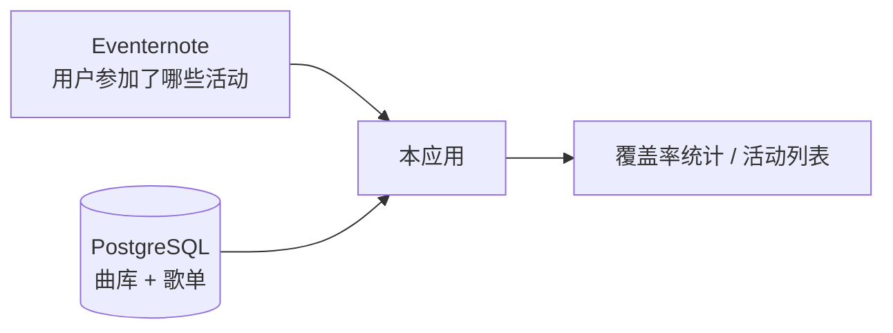

# BanG Dream! 现场听歌统计站

基于 Next.js App Router、PostgreSQL 和 Drizzle 的单页 Web 应用。输入 [Eventernote](https://www.eventernote.com) 用户 ID，抓取该用户参加过的 BanG Dream! 现场活动，对照本地曲目库统计「听过哪些原创曲、哪些还没在现场听到」，并展示各场活动的歌单收录情况。

更完整的模块说明见 [ARCHITECTURE.md](ARCHITECTURE.md)，部署步骤见 [docs/deployment.md](docs/deployment.md)。

## 功能说明

### 用户查询（首页）

- **Eventernote 用户查询**：输入 Eventernote 用户名（非昵称），拉取该账号公开的活动列表。
- **乐队与曲目匹配**：根据活动标题、参演乐队等信息，将每场活动关联到 BanG Dream! 各乐队；已录入数据库的歌单会标记为「已收录」，并计算用户听过的歌曲 ID 集合。
- **覆盖率统计**：按乐队汇总「已听 / 曲库总数」及百分比；支持筛选未演奏曲、虚拟乐团（企划共通）等。
- **活动卡片**：展示参加过的现场，区分歌单已完整收录、部分收录、尚未录入；可展开查看该场演奏曲目。
- **歌曲 ↔ 活动**：点击曲名可懒加载该曲在哪些现场被演奏过（`GET /api/song-events`）。
- **手动刷新**：可强制重新抓取 Eventernote 数据；抓取进行中显示 warming 状态并自动轮询。
- **导出图片**：将统计结果保存为图片分享。
- **主题**：浅色 / 深色 / 跟随系统。
- **可选示例用户**：配置 `DEMO_USER_ID` 后，未输入 ID 时首页展示该用户的示例数据；未配置时仅显示搜索框。

### 管理后台（`/admin`，需 `SETLIST_IMPORT_KEY`）

| 页面 | 作用 |
|------|------|
| **近期活动** | 展示各乐队 Eventernote 演员页的近期活动快照，及数据库中的歌单收录状态，便于补录。 |
| **歌单导入** | 按 Eventernote 活动 ID 或链接导入一场演出的 setlist（纯文本，一行一曲）；自动拉取活动标题/日期/场地；导入前校验曲名是否在曲库中。 |
| **Spotify 歌单辅助** | 在歌单导入页粘贴 Spotify 播放列表链接，解析曲目列表作为导入草稿（需管理员登录）。 |
| **歌曲导入** | 按乐队批量添加新原创曲到曲库（一行一曲 + 首发日）。 |
| **活动屏蔽规则** | 配置标题关键词与 Eventernote event ID，在统计与列表中隐藏非演唱类活动（见面会、上映会等）。 |

定时任务 `GET /api/cron/event-ranking`（需 `CRON_SECRET`）用于刷新「近期活动」快照数据，供管理页与运维脚本使用。

## 设计说明

### 数据来源与职责划分



- **Eventernote**：用户维度的「参加了哪些活动」——标题、日期、场地、活动链接等。通过 HTML 解析抓取，带分页、超时与重试。
- **本地数据库**：BanG Dream! **原创曲曲库**（`songs` + `bands`）以及**已人工维护的 setlist**（`events` + `setlist_entries`）。曲库来自仓库内置 `discography-catalog.json` 的种子数据，**不包含**从 bang-dream.com 在线抓取的流水线。
- **统计逻辑**：仅当某场活动的歌单已录入数据库时，才能把「用户去过这场」转化为「用户听过哪些歌」。未录入歌单的活动仍会显示在活动列表中，但不贡献「听过」计数。

### 活动与乐队匹配

- 各乐队在 `src/lib/constants/bands.ts` 中定义 `slug`、日文名、Eventernote `actorId` 等。
- 用户活动经 `match-rules` 过滤（排除非统计范围的活动类型）后，按 Eventernote 演员/标题规则匹配到一个或多个乐队。
- 同一 Eventernote 活动若关联多支乐队，会在活动卡片上合并展示。

### 曲名匹配

- Setlist 导入与统计时，曲名经 `title-utils` 做 NFKC 规范化、去序号、去合作标注等处理。
- 与曲库匹配时优先精确标题，其次规范化标题；管理端导入前对无法匹配的行给出**最接近曲名建议**。
- 曲库中歌曲按**标题全局唯一**（`songs.title` unique）；一支歌归属一个 `band_slug`。

### 缓存策略

- **用户活动缓存**（`eventernote_user_cache`）：按 Eventernote 用户 ID 缓存解析后的活动列表，默认 TTL 约 12 小时；过期后 stale-while-revalidate——先返回旧数据，后台异步刷新。
- **曲目库 / 匹配结果**：通过 `unstable_cache` 与 tag 失效（导入歌单或歌曲后刷新）。
- **并发刷新**：数据库行上的 `refreshing_started_at` 租约，避免多请求同时全量抓取同一用户。

### 活动可见性

- 静态规则种子：`src/data/event-visibility-rules.json`。
- 运行时可由管理页编辑并写入 `app_settings`；用于隐藏无歌曲统计意义的活动（_talk、上映、发售纪念等）。

### 架构要点

- **RSC 首屏**：`page.tsx` 在服务端调用 `getUserSongStats`，将结果传给 `HomePageClient`，减少客户端瀑布请求。
- **Node.js 运行时**：Eventernote 解析依赖 Cheerio，API 路由与页面均为 `runtime = "nodejs"`。
- **管理鉴权**：`/admin/*` 由 `src/proxy.ts` 重定向至登录；密钥为环境变量 `SETLIST_IMPORT_KEY` 的 HMAC cookie，非账号体系。

### 核心数据表（简述）

| 表 | 含义 |
|----|------|
| `bands` | 乐队元数据 |
| `songs` | 原创曲曲库（归属乐队、首发日、是否曾在已录入歌单中出现） |
| `events` | 一场演出（Eventernote event ID、标题、日期、场地、歌单完整度） |
| `setlist_entries` | 一场演出的曲目行（顺序 + 原始曲名文本） |
| `eventernote_user_cache` | 按用户缓存的活动列表 |
| `app_runtime_snapshots` | 近期活动等运维快照 |
| `app_settings` | 活动屏蔽规则等 JSON 配置 |

## HTTP 接口

本仓库**未提供**完整的公开读写 API 文档站；下列为当前实现，供集成参考。

| 路径 | 鉴权 | 说明 |
|------|------|------|
| `GET /api/bdrsongs?userId=` | 无 | 纯文本统计摘要（适合 Bot）；非稳定公开契约。 |
| `GET /api/song-events?songIds=1,2` | 无 | 返回歌曲参加过的活动列表（JSON）。 |
| `GET /api/default-user-stats` | 无 | 示例用户完整统计 JSON（需配置 `DEMO_USER_ID`）。 |
| `GET /api/user-refresh-status?userId=` | 无 | 用户缓存刷新是否完成（长轮询辅助）。 |
| `GET /api/cron/event-ranking` | `CRON_SECRET` | 刷新近期活动快照。 |
| `POST /api/admin/spotify-setlist` | 管理 cookie | 解析 Spotify 播放列表。 |

**当前不支持**：按场次标题搜索、批量导出 setlist、向第三方站点（如 [bandori.fans](https://bandori.fans/)）写入数据。若有跨站同步需求，需另行扩展只读导出 API 并与目标站点的导入能力对接。

## 技术栈

Next.js 16 · React 19 · TypeScript · Tailwind CSS 4 · Drizzle ORM · PostgreSQL · Cheerio · Zod · Vitest · Playwright

## 开发

```bash
cp .env.example .env.local   # 填写数据库连接与管理密钥
npm install
npm run db:migrate
npm run db:seed
npm run dev
```

`db:seed` 会写入乐队、内置曲库（`src/data/discography-catalog.json`）与活动可见性规则。新增歌曲请用 `/admin/songs-import`；歌单请用 `/admin/setlist-import`。

## 常用脚本

```bash
npm run lint
npm run typecheck
npm run test
npm run test:e2e
npm run db:generate
npm run db:migrate
npm run db:seed
npm run data:import:songs      # 仅重新从 JSON 导入曲库
npm run data:refresh:event-recent   # 刷新近期活动快照（需数据库与环境变量）
```

## 环境变量

| 变量 | 说明 |
|------|------|
| `DATABASE_URL` | 运行时数据库连接（推荐连接池） |
| `DIRECT_URL` | 迁移与 seed 使用的直连（可与 `DATABASE_URL` 相同） |
| `SETLIST_IMPORT_KEY` | 管理页 `/admin/*` 鉴权密钥 |
| `CRON_SECRET` | 保护 `/api/cron/event-ranking` 的 Bearer token |
| `DEMO_USER_ID` | 可选；首页示例展示的 Eventernote 用户 ID |

## 友链

- [Eventernote 年度总结](https://receipt.gyuni.space/) — 本项目的灵感来源
- [日本 live 远征攻略导航](https://genchi.top/)（Sallyn）
- [邦多利资料库 bandori.fans](https://github.com/bangdream-NA/bandori-fans)（北美炸梦同好会）

## 许可证

[MIT](LICENSE)
