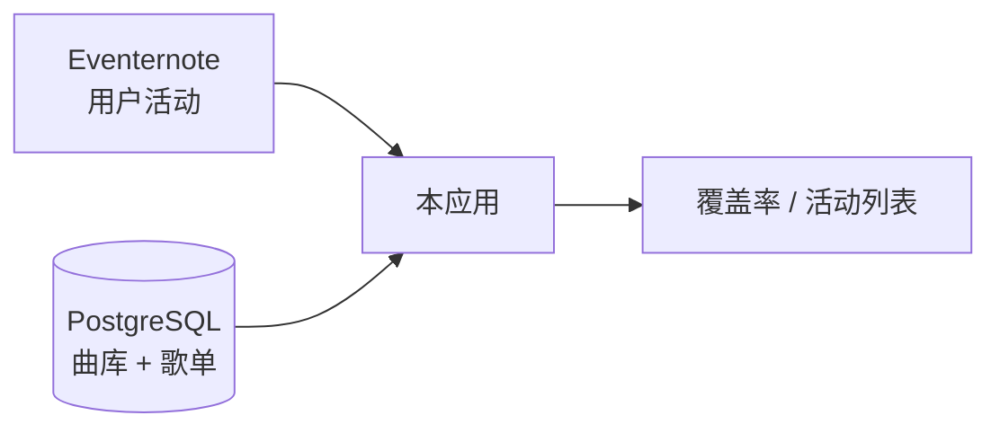

# BanG Dream! 现场听歌统计站

输入 [Eventernote](https://www.eventernote.com) 用户 ID，对照本地 BanG Dream! 曲库与歌单数据，统计「听过哪些原创曲、哪些还没在现场听到」，并展示各场活动的歌单收录情况。

欢迎在本仓库用 [Issue](https://github.com/calcxx/bandori-live-songs/issues) 提交网站使用反馈。维护者会看到并回复；线上站点的修改可能不会立刻同步回这份开源代码。

更完整的模块说明见 [ARCHITECTURE.md](ARCHITECTURE.md)，部署步骤见 [docs/deployment.md](docs/deployment.md)。

## 功能

**首页**

- 按 Eventernote 用户名查询参加过的现场活动
- 按乐队汇总覆盖率（已听 / 曲库总数），支持筛选未演奏曲等
- 展示活动卡片与歌单收录状态；可查看单曲在哪些现场演奏过
- 手动刷新 Eventernote 数据、导出统计图片、浅色/深色主题
- 可选配置 `DEMO_USER_ID` 作为未登录时的示例用户

**管理后台**（`/admin`，需 `SETLIST_IMPORT_KEY`）

- 近期活动 / 活动列表：来自演员页索引的活动浏览；列表支持年份与乐队复选筛选
- 歌单导入：按活动 ID 或链接录入或整场替换 setlist；支持 Spotify 播放列表辅助
- 歌曲导入：向曲库批量添加新曲
- 活动屏蔽规则：隐藏见面会、上映会等非演唱类活动
- 用户缓存：只读浏览 `eventernote_user_cache` 抓取状态与活动数

## 设计概要



- **Eventernote** 提供用户参加了哪些活动；通过 HTML 解析抓取。
- **本地数据库** 维护原创曲曲库（种子数据来自 `discography-catalog.json`）与人工录入的 setlist。只有歌单已录入的活动才计入「听过」。
- 用户活动页只提供参加过的 eventId；是否邦邦、属于哪支乐队由 `bandori_event_index`（演员页权威索引）判定，规避列表页出演者错位。
- 曲名导入时做规范化后与曲库匹配。
- 用户活动缓存在 Postgres：以远程活动总数变化为主失效条件；总数未变但距上次抓取超过 1 天时也会静默后台刷新。详见 [ARCHITECTURE.md](ARCHITECTURE.md)。

## 开发

```bash
cp .env.example .env.local
npm install
npm run db:migrate
npm run db:seed
npm run dev
```

常用命令：`npm run lint` · `npm run test` · `npm run db:generate`

## 环境变量

| 变量 | 说明 |
|------|------|
| `DATABASE_URL` | 数据库连接 |
| `DIRECT_URL` | 迁移用直连（可与上相同） |
| `SETLIST_IMPORT_KEY` | 管理后台密钥 |
| `CRON_SECRET` | 保护定时刷新接口 |
| `DEMO_USER_ID` | 可选，首页示例用户 |

## 友链

- [Eventernote 年度总结](https://receipt.gyuni.space/) — 本项目的灵感来源
- [日本 live 远征攻略导航](https://genchi.top/)（Sallyn）
- [邦多利资料库 bandori.fans](https://github.com/bangdream-NA/bandori-fans)（北美炸梦同好会）

## 许可证

[MIT](LICENSE)
